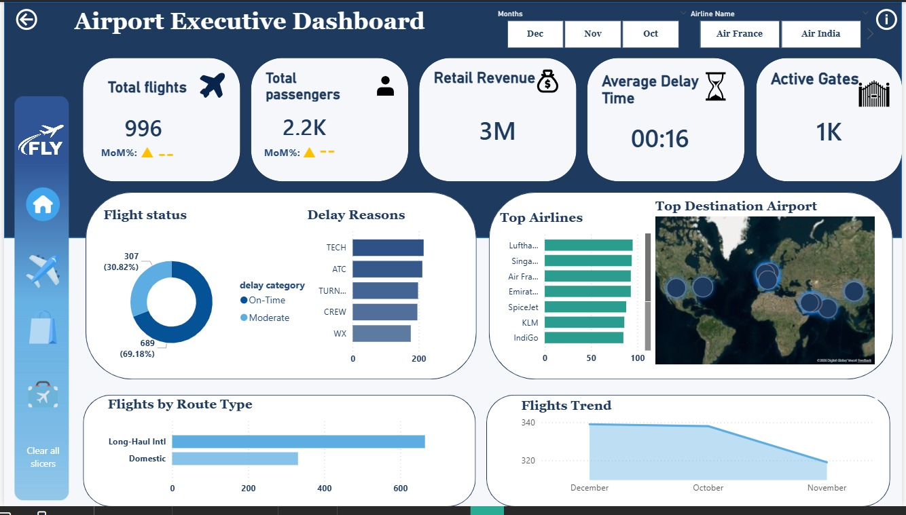
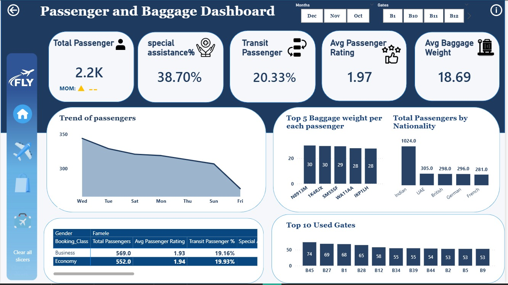
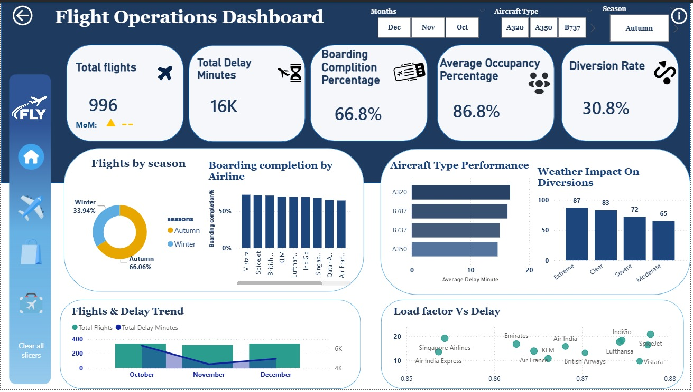
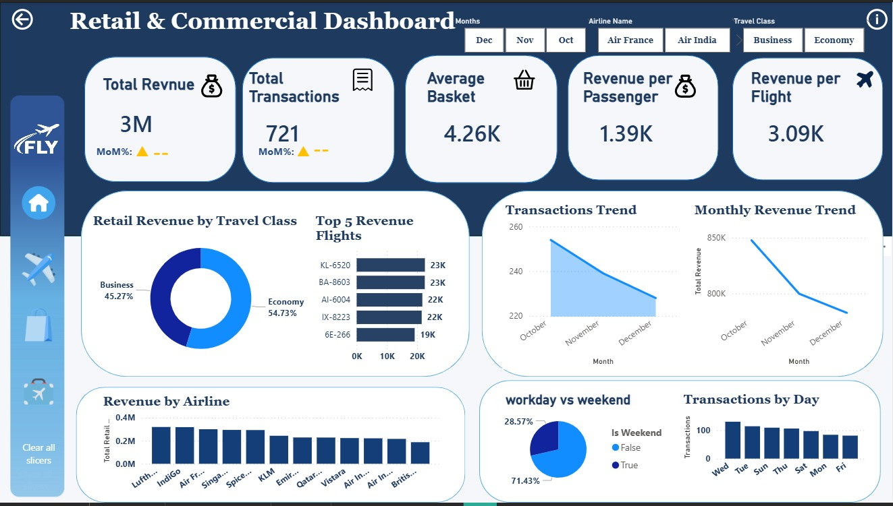
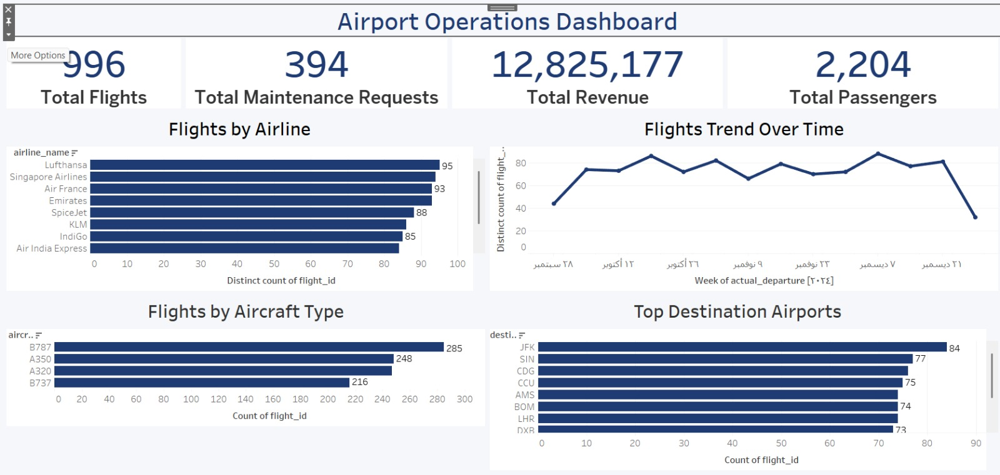

# ✈️ Airport Operations Analytics
An end-to-end data analytics project analyzing airport operations using Python, Power BI, and Tableau to uncover operational insights and support data-driven decision making.

## Project Overview

This project analyzes airport operational data to identify delays, passenger flow, aircraft utilization, baggage handling efficiency, and operational performance.

The project covers the complete analytics workflow including:

- Data Cleaning
- Data Transformation
- Exploratory Data Analysis
- Machine Learning
- Interactive Dashboards
- Business Insights

## Objectives

- Analyze airport operations
- Detect operational bottlenecks
- Understand passenger trends
- Evaluate flight delays
- Monitor baggage operations
- Build interactive dashboards
- Apply machine learning models

## Dataset

The dataset simulates airport operations at Indira Gandhi International Airport (DEL).

Main tables include:

- Flights
- Passengers
- Baggage
- Gate Events
- Security Screening
- Staff Shifts
- Retail Transactions
- Maintenance Logs

## Tech Stack

- Python
- Pandas
- NumPy
- Matplotlib
- Seaborn
- Scikit-Learn
- Power BI
- Power Query
- Tableau
- Jupyter Notebook

## Data Cleaning

The dataset was cleaned using both Python and Power Query.

Tasks included:

- Handling missing values
- Removing duplicates
- Renaming columns
- Data type conversion
- Encoding categorical variables
- Feature engineering

## Exploratory Data Analysis

EDA included:

- Distribution analysis
- Correlation analysis
- Passenger trends
- Delay analysis
- Seasonal trends
- Aircraft utilization

## Machine Learning

Implemented models:

- Linear Regression
- Logistic Regression
- Decision Tree
- Random Forest

Evaluation Metrics:

- Accuracy
- Precision
- Recall
- F1 Score
- MAE
- RMSE
- R²

## Dashboards

Power BI Dashboards

- Executive Overview
- Flight Performance
- Passenger & Baggage Analysis
- Retail Analysis

Tableau Dashboard

- Airport Performance Dashboard

## Dashboard Preview

### Executive Dashboard

---

### Passenger & Baggage Dashboard

---

### Flight Performance Dashboard

---

### Retail Dashboard

---

### Tableau Dashboard

## Team Members
- [Moaaz Hamada Bakry](https://github.com/moaaz256) — Data Cleaning & Python
- [Abdelmoniem Ahmed Ali](https://github.com/AbdelmoneimAhmedAbdalla) — Data Cleaning
- Alhassan Sherif Ebrahim — Tableau Dashboard
- [Adham Atia Abdelsattar](https://github.com/Adham2tia) — Modeling & Power bi Dashboard
- [Jana Ahmed Rashad](https://github.com/Jana-Ahmed200) — Power bi Dashboard
- Jana Ahmed Mohammed — Power bi Dashboard
